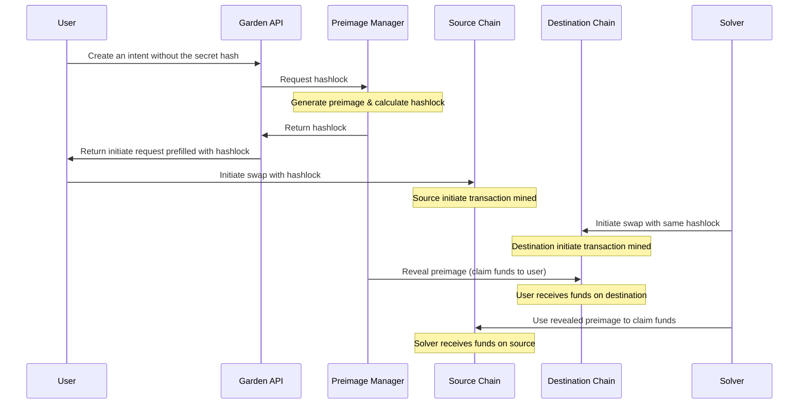

--- Content from https://docs.garden.finance/developers/overview.md ---

# Developer Overview

> Integrate Garden's Bitcoin bridging capabilities into your wallet, aggregator, or dApp

Garden was built with the vision of enabling Bitcoin in DeFi as seamlessly as possible. To achieve this, we've designed Garden to be easy to integrate into any wallet, aggregator, or dApp, empowering developers to unlock Bitcoin's potential in their products.

## What does Garden unlock?

Traditionally, cross-chain flows require users to manually bridge their Bitcoin before using those funds in dApps. Garden simplifies this with an SDK and API that abstracts the bridging process, letting users directly utilize Bitcoin within DeFi ecosystems. Here's what Garden can enable:

<CardGroup cols={3}>
  <Card title="Bitcoin liquidity access" icon="bitcoin">
    Access to Bitcoin's existing liquidity, seamlessly integrated into your product or chain.
  </Card>

  <Card title="Native Bitcoin experience" icon="user-check">
    A native Bitcoin experience for users, free from bridging complexities.
  </Card>

  <Card title="Customizable tools" icon="screwdriver-wrench">
    Customizable SDK and API tools designed to fit your unique use case.
  </Card>
</CardGroup>

## Choosing between SDK and API

Choosing between Garden's SDK and API depends on your project's requirements:

### SDK

Garden SDK is a customizable API wrapper tailored for React and Node-based dApps. It simplifies integration with a plug-and-play approach, requiring minimal setup. This is ideal for developers seeking a quick and efficient way to integrate Bitcoin swaps with minimal setup. Check out the quick start guides for [React](/developers/sdk/react/quickstart) and [Node](/developers/sdk/nodejs/quickstart) to get an understanding.

### API

Garden APIs are designed for broader application environments, such as wallets, mobile apps, or implementations in Rust, Go, or other programming languages. While highly flexible, it requires more development effort, making it perfect for advanced workflows. Begin with exploring the [API overview](/developers/api/overview).

<div className="overflow-x-auto">
  | **Feature**               | **SDK**                             | **API**                                    |
  | ------------------------- | ----------------------------------- | ------------------------------------------ |
  | **Integration speed**     | Quick and simple                    | Requires more effort and expertise         |
  | **Best for**              | React, Node-based dApps             | Wallets, mobile apps, diverse setups       |
  | **Recommended use cases** | Standard swaps in existing products | Advanced workflows and unique environments |
</div>


--- Content from https://docs.garden.finance/developers/supported-chains.md ---

# Supported Chains and Assets

export const getChainName = chain => {
  return CHAIN_NAMES[chain] || chain;
};

export const CHAIN_NAMES = {
  bnbchain: "BNB Chain",
  bnbchain_testnet: "BNB Chain Testnet"
};

export const titilize = chain => {
  const chainSplit = chain.split("_");
  const firstWord = chainSplit[0].charAt(0).toUpperCase() + chainSplit[0].slice(1);
  const secondWord = chainSplit.length > 1 ? chainSplit[1].charAt(0).toUpperCase() + chainSplit[1].slice(1) : "";
  return firstWord + " " + secondWord;
};

export const CHAIN_EXPLORERS = {
  botanix: "https://botanixscan.io/",
  hyperliquid: "https://purrsec.com/",
  corn: "https://cornscan.io/",
  ethereum: "https://etherscan.io/",
  bera: "https://berascan.com/",
  starknet: "https://starkscan.co/",
  solana: "https://explorer.solana.com/",
  base: "https://basescan.org/",
  unichain: "https://uniscan.xyz/",
  arbitrum: "https://arbiscan.io/",
  bitcoin: "https://mempool.space/",
  bnbchain: "https://bscscan.com/",
  starknet_sepolia: "https://sepolia.starkscan.co/",
  ethereum_sepolia: "https://sepolia.etherscan.io/",
  solana_testnet: "https://explorer.solana.com/",
  citrea_testnet: "https://explorer.testnet.citrea.xyz/",
  base_sepolia: "https://sepolia.basescan.org/",
  monad_testnet: "https://explorer.monad-devnet.devnet101.com",
  arbitrum_sepolia: "https://sepolia.arbiscan.io/",
  bitcoin_testnet: "https://mempool.space/testnet4/",
  bnbchain_testnet: "https://testnet.bscscan.com/"
};

export const getExplorerUrl = (chain, address) => {
  if (chain.includes("bitcoin")) {
    return "/contracts/bitcoin";
  } else if (chain.includes("starknet")) {
    return CHAIN_EXPLORERS[chain] + "contract/" + address + "#overview";
  } else if (chain.includes("solana")) {
    return CHAIN_EXPLORERS[chain] + "address/" + "2bag6xpshpvPe7SJ9nSDLHpxqhEAoHPGpEkjNSv7gxoF" + (chain.includes("testnet") ? "?cluster=devnet" : "");
  } else {
    return CHAIN_EXPLORERS[chain] + "address/" + address + "#code";
  }
};

export const trimAssetName = id => {
  return id.split(":")[1].toUpperCase();
};

export const getAssets = async (url = MAINNET_ASSETS_URL) => {
  try {
    const response = await fetch(url);
    const data = await response.json();
    if (data.status.includes("OK")) {
      return [];
    }
    const sortedResult = data.result.sort((a, b) => {
      return a.chain.localeCompare(b.chain);
    });
    console.log(sortedResult[0].assets[0].htlc.address);
    return sortedResult;
  } catch (error) {
    console.log("Error fetching assets", error);
    return [];
  }
};

export const TESTNET_ASSETS_URL = "https://testnet.api.garden.finance/v2/chains";

export const MAINNET_ASSETS_URL = "https://api.garden.finance/v2/chains";

export const AssetRow = ({chain, assets}) => {
  return <tr>
      <td className="flex items-center gap-2 w-full whitespace-nowrap border-r-[1px] border-[#e5e1e2] dark:border-[#454143]/50" colSpan={4}>
        <Frame className="pointer-events-none w-[20px]">
          
        </Frame>
        <strong>{titilize(getChainName(chain.chain))}</strong>
      </td>
      <td colSpan={4}>
        <div className="flex gap-4 flex-wrap mx-2">
          {assets.map((asset, i) => <a key={i} href={getExplorerUrl(chain.chain, asset.htlc?.address)} className="border-none flex items-center gap-2">
              <Frame className="pointer-events-none w-[20px]">
                
              </Frame>
              <span>{trimAssetName(asset.id)}</span>
            </a>)}
        </div>
      </td>
    </tr>;
};

export const SupportedAssets = ({url}) => {
  const [supportedAssetsConfig, setSupportedAssetsConfig] = useState([]);
  useEffect(() => {
    const fetchAssets = async () => {
      try {
        const assetsConfig = await getAssets(url);
        setSupportedAssetsConfig(assetsConfig);
      } catch (error) {
        console.error("Failed to fetch assets:", error);
      }
    };
    fetchAssets();
  }, []);
  return <table className="w-full table-auto border-collapse">
      <thead>
        <tr>
          <th>Chain</th>
          <th colSpan="4">Asset HTLCs</th>
        </tr>
      </thead>
      <tbody>
        {supportedAssetsConfig.map((chainConfig, i) => <AssetRow key={i} chain={{
    chain: chainConfig.chain,
    icon: chainConfig.icon
  }} assets={chainConfig.assets} />)}
      </tbody>
    </table>;
};

Garden uses the following contracts to perform swaps on respective chains:

<Tabs>
  <Tab title="Mainnet">
    <SupportedAssets key={MAINNET_ASSETS_URL} url={MAINNET_ASSETS_URL} />
  </Tab>

  <Tab title="Testnet">
    <SupportedAssets key={TESTNET_ASSETS_URL} url={TESTNET_ASSETS_URL} />
  </Tab>
</Tabs>

<Tip>
  If you would like to see a chain or asset that isn't listed here, reach out to
  us in the [Townhall](https://discord.gg/dZwSjh9922).
</Tip>


--- Content from https://docs.garden.finance/developers/supported-routes.md ---

# Supported Routes

> Follow our route policy system to validate supported asset trading pairs

## Overview

The route policy system provides a lightweight way to determine which asset pairs can be traded without requiring individual API calls for each route validation. Instead of fetching all possible routes from the server, you can download a compact policy configuration and compute valid routes locally.

<Tip>
  This approach significantly reduces API calls and enables real-time route validation in your application.
</Tip>

## How it works

Route policies use a priority-based validation system with four key components:

1. **Isolation Groups** (Highest Priority): Assets that can ONLY trade with each other.
2. **Whitelist Overrides**: Explicit exceptions that bypass other restrictions.
3. **Blacklist Pairs**: Forbidden trading pairs with wildcard support.
4. **Default Policy**: Fallback behavior for unconfigured routes.

<Steps>
  <Step title="Isolation groups">
    If either asset is in an isolation group, the route is only valid if both assets are in the same isolation group.

    ```typescript
    // Example: SEED tokens can only trade with other SEED tokens
    "ethereum:SEED <-> arbitrum:SEED"
    ```
  </Step>

  <Step title="Whitelist overrides">
    Explicit exceptions that allow routes regardless of other restrictions.

    ```typescript
    // Example: Allow specific emergency routes
    "bitcoin:BTC -> ethereum:WBTC"
    ```
  </Step>

  <Step title="Blacklist pairs">
    Forbidden routes that override the default policy.

    ```typescript
    // Example: Prevent direct BTC to wrapped BTC trades
    "bitcoin:BTC -> *:WBTC"
    ```
  </Step>

  <Step title="Default policy">
    Applied when no other rules match — either "open" (allow) or "closed" (deny).
  </Step>
</Steps>

## Local route matrix generation

Here's a complete script to route matrix generation for local route validation:

<CodeGroup>
  ```typescript TypeScript expandable
  // Types for the policy configuration
  interface RoutePolicy {
    default: 'open' | 'closed';
    isolation_groups: string[];
    blacklist_pairs: string[];
    whitelist_overrides: string[];
  }

  interface PolicyResponse {
    status: 'Ok' | 'Error';
    result: RoutePolicy;
    error?: string;
  }

  // Asset identifier type
  type AssetId = string; // e.g., "ethereum:SEED", "bitcoin:BTC"

  class RouteValidator {
    private policy: RoutePolicy | null = null;

    constructor(private apiBaseUrl: string, private apiKey: string) {}

    // Fetch policy from the API
    async loadPolicy(): Promise<void> {
      try {
        const response = await fetch(`${this.apiBaseUrl}/policy`, {
          headers: {
            'garden-app-id': this.apiKey,
            'accept': 'application/json'
          }
        });

        const data: PolicyResponse = await response.json();
        
        if (data.status === 'Ok') {
          this.policy = data.result;
        } else {
          throw new Error(`API Error: ${data.error}`);
        }
      } catch (error) {
        throw new Error(`Failed to load policy: ${error}`);
      }
    }

    // Check if a route is valid based on the policy
    isValidRoute(fromAsset: AssetId, toAsset: AssetId): boolean {
      if (!this.policy) {
        throw new Error('Policy not loaded. Call loadPolicy() first.');
      }

      // Can't swap to the same asset
      if (fromAsset === toAsset) {
        return false;
      }

      // Check isolation groups first (highest priority)
      if (this.isInIsolationGroup(fromAsset, toAsset)) {
        return this.isValidIsolationGroup(fromAsset, toAsset);
      }

      // Check whitelist overrides (bypass other restrictions)
      if (this.isWhitelistOverride(fromAsset, toAsset)) {
        return true;
      }

      // Check blacklist pairs
      if (this.isBlacklisted(fromAsset, toAsset)) {
        return false;
      }

      // Apply default policy
      return this.policy.default === 'open';
    }

    // Get all valid destination assets for a given source asset
    getValidDestinations(fromAsset: AssetId, allAssets: AssetId[]): AssetId[] {
      return allAssets.filter(toAsset => this.isValidRoute(fromAsset, toAsset));
    }

    // Get all possible routes from a list of assets
    getAllValidRoutes(assets: AssetId[]): Array<{ from: AssetId; to: AssetId }> {
      const routes: Array<{ from: AssetId; to: AssetId }> = [];
      
      for (const fromAsset of assets) {
        for (const toAsset of assets) {
          if (this.isValidRoute(fromAsset, toAsset)) {
            routes.push({ from: fromAsset, to: toAsset });
          }
        }
      }
      
      return routes;
    }

    // Private helper methods
    private isInIsolationGroup(fromAsset: AssetId, toAsset: AssetId): boolean {
      return this.policy!.isolation_groups.some(group => {
        const assets = this.parseIsolationGroup(group);
        return assets.includes(fromAsset) || assets.includes(toAsset);
      });
    }

    private isValidIsolationGroup(fromAsset: AssetId, toAsset: AssetId): boolean {
      return this.policy!.isolation_groups.some(group => {
        const assets = this.parseIsolationGroup(group);
        return assets.includes(fromAsset) && assets.includes(toAsset);
      });
    }

    private isWhitelistOverride(fromAsset: AssetId, toAsset: AssetId): boolean {
      return this.policy!.whitelist_overrides.some(override => 
        this.matchesPattern(fromAsset, toAsset, override)
      );
    }

    private isBlacklisted(fromAsset: AssetId, toAsset: AssetId): boolean {
      return this.policy!.blacklist_pairs.some(blacklist => 
        this.matchesPattern(fromAsset, toAsset, blacklist)
      );
    }

    private parseIsolationGroup(group: string): AssetId[] {
      // Parse "ethereum:SEED <-> arbitrum:SEED" format
      const assets = group.split('<->').map(asset => asset.trim());
      return assets;
    }

    private matchesPattern(fromAsset: AssetId, toAsset: AssetId, pattern: string): boolean {
      const [fromPattern, toPattern] = pattern.split('->').map(p => p.trim());
      
      return this.matchesAssetPattern(fromAsset, fromPattern) && 
             this.matchesAssetPattern(toAsset, toPattern);
    }

    private matchesAssetPattern(asset: AssetId, pattern: string): boolean {
      // Handle wildcard patterns
      if (pattern === '*') return true;
      
      if (pattern.includes('*')) {
        // Handle patterns like "starknet:*" or "*:USDC"
        if (pattern.endsWith(':*')) {
          const chainPattern = pattern.slice(0, -2);
          return asset.startsWith(chainPattern + ':');
        }
        if (pattern.startsWith('*:')) {
          const symbolPattern = pattern.slice(2);
          return asset.endsWith(':' + symbolPattern);
        }
      }
      
      // Exact match
      return asset === pattern;
    }
  }

  // Helper function to build route matrix for UI
  function buildRouteMatrix(assets: AssetId[], validator: RouteValidator): Record<AssetId, AssetId[]> {
    const matrix: Record<AssetId, AssetId[]> = {};
    
    for (const fromAsset of assets) {
      matrix[fromAsset] = validator.getValidDestinations(fromAsset, assets);
    }
    
    return matrix;
  }

  // Export for use in your application
  export { RouteValidator, buildRouteMatrix, type RoutePolicy, type AssetId };
  ```

  ```rust Rust expandable
  use std::collections::HashMap;
  use serde::{Deserialize, Serialize};
  use reqwest;
  use anyhow::{Result, Error};

  // Types for the policy configuration
  #[derive(Debug, Clone, Serialize, Deserialize)]
  pub struct RoutePolicy {
      pub default: String, // "open" or "closed"
      pub isolation_groups: Vec<String>,
      pub blacklist_pairs: Vec<String>,
      pub whitelist_overrides: Vec<String>,
  }

  #[derive(Debug, Serialize, Deserialize)]
  pub struct PolicyResponse {
      pub status: String,
      pub result: RoutePolicy,
      pub error: Option<String>,
  }

  pub type AssetId = String;

  pub struct RouteValidator {
      api_base_url: String,
      api_key: String,
      policy: Option<RoutePolicy>,
  }

  impl RouteValidator {
      pub fn new(api_base_url: String, api_key: String) -> Self {
          RouteValidator {
              api_base_url,
              api_key,
              policy: None,
          }
      }

      // Fetch policy from the API
      pub async fn load_policy(&mut self) -> Result<()> {
          let client = reqwest::Client::new();
          let url = format!("{}/policy", self.api_base_url);
          
          let response = client
              .get(&url)
              .header("garden-app-id", &self.api_key)
              .header("accept", "application/json")
              .send()
              .await?;

          let data: PolicyResponse = response.json().await?;
          
          if data.status == "Ok" {
              self.policy = Some(data.result);
              Ok(())
          } else {
              Err(Error::msg(format!("API Error: {:?}", data.error)))
          }
      }

      // Check if a route is valid based on the policy
      pub fn is_valid_route(&self, from_asset: &AssetId, to_asset: &AssetId) -> Result<bool> {
          let policy = self.policy.as_ref()
              .ok_or_else(|| Error::msg("Policy not loaded. Call load_policy() first."))?;

          // Can't swap to the same asset
          if from_asset == to_asset {
              return Ok(false);
          }

          // Check isolation groups first (highest priority)
          if self.is_in_isolation_group(from_asset, to_asset, policy) {
              return Ok(self.is_valid_isolation_group(from_asset, to_asset, policy));
          }

          // Check whitelist overrides (bypass other restrictions)
          if self.is_whitelist_override(from_asset, to_asset, policy) {
              return Ok(true);
          }

          // Check blacklist pairs
          if self.is_blacklisted(from_asset, to_asset, policy) {
              return Ok(false);
          }

          // Apply default policy
          Ok(policy.default == "open")
      }

      // Get all valid destination assets for a given source asset
      pub fn get_valid_destinations(&self, from_asset: &AssetId, all_assets: &[AssetId]) -> Result<Vec<AssetId>> {
          let mut valid_destinations = Vec::new();
          
          for to_asset in all_assets {
              if self.is_valid_route(from_asset, to_asset)? {
                  valid_destinations.push(to_asset.clone());
              }
          }
          
          Ok(valid_destinations)
      }

      // Get all possible routes from a list of assets
      pub fn get_all_valid_routes(&self, assets: &[AssetId]) -> Result<Vec<(AssetId, AssetId)>> {
          let mut routes = Vec::new();
          
          for from_asset in assets {
              for to_asset in assets {
                  if self.is_valid_route(from_asset, to_asset)? {
                      routes.push((from_asset.clone(), to_asset.clone()));
                  }
              }
          }
          
          Ok(routes)
      }

      // Private helper methods
      fn is_in_isolation_group(&self, from_asset: &AssetId, to_asset: &AssetId, policy: &RoutePolicy) -> bool {
          policy.isolation_groups.iter().any(|group| {
              let assets = self.parse_isolation_group(group);
              assets.contains(from_asset) || assets.contains(to_asset)
          })
      }

      fn is_valid_isolation_group(&self, from_asset: &AssetId, to_asset: &AssetId, policy: &RoutePolicy) -> bool {
          policy.isolation_groups.iter().any(|group| {
              let assets = self.parse_isolation_group(group);
              assets.contains(from_asset) && assets.contains(to_asset)
          })
      }

      fn is_whitelist_override(&self, from_asset: &AssetId, to_asset: &AssetId, policy: &RoutePolicy) -> bool {
          policy.whitelist_overrides.iter().any(|override_pattern| {
              self.matches_pattern(from_asset, to_asset, override_pattern)
          })
      }

      fn is_blacklisted(&self, from_asset: &AssetId, to_asset: &AssetId, policy: &RoutePolicy) -> bool {
          policy.blacklist_pairs.iter().any(|blacklist_pattern| {
              self.matches_pattern(from_asset, to_asset, blacklist_pattern)
          })
      }

      fn parse_isolation_group(&self, group: &str) -> Vec<AssetId> {
          group.split("<->")
              .map(|asset| asset.trim().to_string())
              .collect()
      }

      fn matches_pattern(&self, from_asset: &AssetId, to_asset: &AssetId, pattern: &str) -> bool {
          let parts: Vec<&str> = pattern.split("->").map(|p| p.trim()).collect();
          if parts.len() != 2 {
              return false;
          }
          
          self.matches_asset_pattern(from_asset, parts[0]) && 
          self.matches_asset_pattern(to_asset, parts[1])
      }

      fn matches_asset_pattern(&self, asset: &AssetId, pattern: &str) -> bool {
          // Handle wildcard patterns
          if pattern == "*" {
              return true;
          }
          
          if pattern.contains('*') {
              // Handle patterns like "starknet:*" or "*:USDC"
              if pattern.ends_with(":*") {
                  let chain_pattern = &pattern[..pattern.len() - 2];
                  return asset.starts_with(&format!("{}:", chain_pattern));
              }
              if pattern.starts_with("*:") {
                  let symbol_pattern = &pattern[2..];
                  return asset.ends_with(&format!(":{}", symbol_pattern));
              }
          }
          
          // Exact match
          asset == pattern
      }
  }

  // Helper function to build route matrix for UI
  pub fn build_route_matrix(assets: &[AssetId], validator: &RouteValidator) -> Result<HashMap<AssetId, Vec<AssetId>>> {
      let mut matrix = HashMap::new();
      
      for from_asset in assets {
          let destinations = validator.get_valid_destinations(from_asset, assets)?;
          matrix.insert(from_asset.clone(), destinations);
      }
      
      Ok(matrix)
  }
  ```

  ```go Golang expandable
  package main

  import (
      "encoding/json"
      "fmt"
      "net/http"
      "strings"
      "errors"
  )

  // Types for the policy configuration
  type RoutePolicy struct {
      Default           string   `json:"default"`
      IsolationGroups   []string `json:"isolation_groups"`
      BlacklistPairs    []string `json:"blacklist_pairs"`
      WhitelistOverrides []string `json:"whitelist_overrides"`
  }

  type PolicyResponse struct {
      Status string      `json:"status"`
      Result RoutePolicy `json:"result"`
      Error  *string     `json:"error,omitempty"`
  }

  type AssetId string

  type RouteValidator struct {
      apiBaseURL string
      apiKey     string
      policy     *RoutePolicy
  }

  func NewRouteValidator(apiBaseURL, apiKey string) *RouteValidator {
      return &RouteValidator{
          apiBaseURL: apiBaseURL,
          apiKey:     apiKey,
          policy:     nil,
      }
  }

  // Fetch policy from the API
  func (rv *RouteValidator) LoadPolicy() error {
      client := &http.Client{}
      url := fmt.Sprintf("%s/policy", rv.apiBaseURL)
      
      req, err := http.NewRequest("GET", url, nil)
      if err != nil {
          return err
      }
      
      req.Header.Set("garden-app-id", rv.apiKey)
      req.Header.Set("accept", "application/json")
      
      resp, err := client.Do(req)
      if err != nil {
          return err
      }
      defer resp.Body.Close()
      
      var data PolicyResponse
      if err := json.NewDecoder(resp.Body).Decode(&data); err != nil {
          return err
      }
      
      if data.Status == "Ok" {
          rv.policy = &data.Result
          return nil
      }
      
      errorMsg := "Unknown error"
      if data.Error != nil {
          errorMsg = *data.Error
      }
      return fmt.Errorf("API Error: %s", errorMsg)
  }

  // Check if a route is valid based on the policy
  func (rv *RouteValidator) IsValidRoute(fromAsset, toAsset AssetId) (bool, error) {
      if rv.policy == nil {
          return false, errors.New("policy not loaded. Call LoadPolicy() first")
      }
      
      // Can't swap to the same asset
      if fromAsset == toAsset {
          return false, nil
      }
      
      // Check isolation groups first (highest priority)
      if rv.isInIsolationGroup(fromAsset, toAsset) {
          return rv.isValidIsolationGroup(fromAsset, toAsset), nil
      }
      
      // Check whitelist overrides (bypass other restrictions)
      if rv.isWhitelistOverride(fromAsset, toAsset) {
          return true, nil
      }
      
      // Check blacklist pairs
      if rv.isBlacklisted(fromAsset, toAsset) {
          return false, nil
      }
      
      // Apply default policy
      return rv.policy.Default == "open", nil
  }

  // Get all valid destination assets for a given source asset
  func (rv *RouteValidator) GetValidDestinations(fromAsset AssetId, allAssets []AssetId) ([]AssetId, error) {
      var validDestinations []AssetId
      
      for _, toAsset := range allAssets {
          if valid, err := rv.IsValidRoute(fromAsset, toAsset); err != nil {
              return nil, err
          } else if valid {
              validDestinations = append(validDestinations, toAsset)
          }
      }
      
      return validDestinations, nil
  }

  // Get all possible routes from a list of assets
  func (rv *RouteValidator) GetAllValidRoutes(assets []AssetId) ([]struct{From, To AssetId}, error) {
      var routes []struct{From, To AssetId}
      
      for _, fromAsset := range assets {
          for _, toAsset := range assets {
              if valid, err := rv.IsValidRoute(fromAsset, toAsset); err != nil {
                  return nil, err
              } else if valid {
                  routes = append(routes, struct{From, To AssetId}{From: fromAsset, To: toAsset})
              }
          }
      }
      
      return routes, nil
  }

  // Private helper methods
  func (rv *RouteValidator) isInIsolationGroup(fromAsset, toAsset AssetId) bool {
      for _, group := range rv.policy.IsolationGroups {
          assets := rv.parseIsolationGroup(group)
          if rv.contains(assets, fromAsset) || rv.contains(assets, toAsset) {
              return true
          }
      }
      return false
  }

  func (rv *RouteValidator) isValidIsolationGroup(fromAsset, toAsset AssetId) bool {
      for _, group := range rv.policy.IsolationGroups {
          assets := rv.parseIsolationGroup(group)
          if rv.contains(assets, fromAsset) && rv.contains(assets, toAsset) {
              return true
          }
      }
      return false
  }

  func (rv *RouteValidator) isWhitelistOverride(fromAsset, toAsset AssetId) bool {
      for _, override := range rv.policy.WhitelistOverrides {
          if rv.matchesPattern(fromAsset, toAsset, override) {
              return true
          }
      }
      return false
  }

  func (rv *RouteValidator) isBlacklisted(fromAsset, toAsset AssetId) bool {
      for _, blacklist := range rv.policy.BlacklistPairs {
          if rv.matchesPattern(fromAsset, toAsset, blacklist) {
              return true
          }
      }
      return false
  }

  func (rv *RouteValidator) parseIsolationGroup(group string) []AssetId {
      parts := strings.Split(group, "<->")
      var assets []AssetId
      for _, part := range parts {
          assets = append(assets, AssetId(strings.TrimSpace(part)))
      }
      return assets
  }

  func (rv *RouteValidator) matchesPattern(fromAsset, toAsset AssetId, pattern string) bool {
      parts := strings.Split(pattern, "->")
      if len(parts) != 2 {
          return false
      }
      
      fromPattern := strings.TrimSpace(parts[0])
      toPattern := strings.TrimSpace(parts[1])
      
      return rv.matchesAssetPattern(fromAsset, fromPattern) && 
             rv.matchesAssetPattern(toAsset, toPattern)
  }

  func (rv *RouteValidator) matchesAssetPattern(asset AssetId, pattern string) bool {
      // Handle wildcard patterns
      if pattern == "*" {
          return true
      }
      
      if strings.Contains(pattern, "*") {
          // Handle patterns like "starknet:*" or "*:USDC"
          if strings.HasSuffix(pattern, ":*") {
              chainPattern := pattern[:len(pattern)-2]
              return strings.HasPrefix(string(asset), chainPattern+":")
          }
          if strings.HasPrefix(pattern, "*:") {
              symbolPattern := pattern[2:]
              return strings.HasSuffix(string(asset), ":"+symbolPattern)
          }
      }
      
      // Exact match
      return string(asset) == pattern
  }

  func (rv *RouteValidator) contains(slice []AssetId, item AssetId) bool {
      for _, s := range slice {
          if s == item {
              return true
          }
      }
      return false
  }

  // Helper function to build route matrix for UI
  func BuildRouteMatrix(assets []AssetId, validator *RouteValidator) (map[AssetId][]AssetId, error) {
      matrix := make(map[AssetId][]AssetId)
      
      for _, fromAsset := range assets {
          destinations, err := validator.GetValidDestinations(fromAsset, assets)
          if err != nil {
              return nil, err
          }
          matrix[fromAsset] = destinations
      }
      
      return matrix, nil
  }
  ```

  ```python Python expandable
  import requests
  from typing import List, Dict, Optional, Tuple
  from dataclasses import dataclass
  import json

  # Types for the policy configuration
  @dataclass
  class RoutePolicy:
      default: str  # "open" or "closed"
      isolation_groups: List[str]
      blacklist_pairs: List[str]
      whitelist_overrides: List[str]

  @dataclass
  class PolicyResponse:
      status: str
      result: RoutePolicy
      error: Optional[str] = None

  AssetId = str

  class RouteValidator:
      def __init__(self, api_base_url: str, api_key: str):
          self.api_base_url = api_base_url
          self.api_key = api_key
          self.policy: Optional[RoutePolicy] = None

      async def load_policy(self) -> None:
          """Fetch policy from the API"""
          try:
              headers = {
                  'garden-app-id': self.api_key,
                  'accept': 'application/json'
              }
              
              response = requests.get(f"{self.api_base_url}/policy", headers=headers)
              response.raise_for_status()
              
              data = response.json()
              
              if data['status'] == 'Ok':
                  result = data['result']
                  self.policy = RoutePolicy(
                      default=result['default'],
                      isolation_groups=result['isolation_groups'],
                      blacklist_pairs=result['blacklist_pairs'],
                      whitelist_overrides=result['whitelist_overrides']
                  )
              else:
                  raise Exception(f"API Error: {data.get('error', 'Unknown error')}")
                  
          except Exception as e:
              raise Exception(f"Failed to load policy: {e}")

      def is_valid_route(self, from_asset: AssetId, to_asset: AssetId) -> bool:
          """Check if a route is valid based on the policy"""
          if self.policy is None:
              raise Exception("Policy not loaded. Call load_policy() first.")

          # Can't swap to the same asset
          if from_asset == to_asset:
              return False

          # Check isolation groups first (highest priority)
          if self._is_in_isolation_group(from_asset, to_asset):
              return self._is_valid_isolation_group(from_asset, to_asset)

          # Check whitelist overrides (bypass other restrictions)
          if self._is_whitelist_override(from_asset, to_asset):
              return True

          # Check blacklist pairs
          if self._is_blacklisted(from_asset, to_asset):
              return False

          # Apply default policy
          return self.policy.default == 'open'

      def get_valid_destinations(self, from_asset: AssetId, all_assets: List[AssetId]) -> List[AssetId]:
          """Get all valid destination assets for a given source asset"""
          return [to_asset for to_asset in all_assets if self.is_valid_route(from_asset, to_asset)]

      def get_all_valid_routes(self, assets: List[AssetId]) -> List[Tuple[AssetId, AssetId]]:
          """Get all possible routes from a list of assets"""
          routes = []
          
          for from_asset in assets:
              for to_asset in assets:
                  if self.is_valid_route(from_asset, to_asset):
                      routes.append((from_asset, to_asset))
          
          return routes

      # Private helper methods
      def _is_in_isolation_group(self, from_asset: AssetId, to_asset: AssetId) -> bool:
          for group in self.policy.isolation_groups:
              assets = self._parse_isolation_group(group)
              if from_asset in assets or to_asset in assets:
                  return True
          return False

      def _is_valid_isolation_group(self, from_asset: AssetId, to_asset: AssetId) -> bool:
          for group in self.policy.isolation_groups:
              assets = self._parse_isolation_group(group)
              if from_asset in assets and to_asset in assets:
                  return True
          return False

      def _is_whitelist_override(self, from_asset: AssetId, to_asset: AssetId) -> bool:
          return any(self._matches_pattern(from_asset, to_asset, override) 
                    for override in self.policy.whitelist_overrides)

      def _is_blacklisted(self, from_asset: AssetId, to_asset: AssetId) -> bool:
          return any(self._matches_pattern(from_asset, to_asset, blacklist) 
                    for blacklist in self.policy.blacklist_pairs)

      def _parse_isolation_group(self, group: str) -> List[AssetId]:
          """Parse 'ethereum:SEED <-> arbitrum:SEED' format"""
          return [asset.strip() for asset in group.split('<->')]

      def _matches_pattern(self, from_asset: AssetId, to_asset: AssetId, pattern: str) -> bool:
          parts = [p.strip() for p in pattern.split('->')]
          if len(parts) != 2:
              return False
          
          from_pattern, to_pattern = parts
          return (self._matches_asset_pattern(from_asset, from_pattern) and 
                  self._matches_asset_pattern(to_asset, to_pattern))

      def _matches_asset_pattern(self, asset: AssetId, pattern: str) -> bool:
          """Handle wildcard patterns"""
          if pattern == '*':
              return True
          
          if '*' in pattern:
              # Handle patterns like "starknet:*" or "*:USDC"
              if pattern.endswith(':*'):
                  chain_pattern = pattern[:-2]
                  return asset.startswith(chain_pattern + ':')
              if pattern.startswith('*:'):
                  symbol_pattern = pattern[2:]
                  return asset.endswith(':' + symbol_pattern)
          
          # Exact match
          return asset == pattern

  # Helper function to build route matrix for UI
  def build_route_matrix(assets: List[AssetId], validator: RouteValidator) -> Dict[AssetId, List[AssetId]]:
      """Build route matrix for UI components"""
      matrix = {}
      
      for from_asset in assets:
          matrix[from_asset] = validator.get_valid_destinations(from_asset, assets)
      
      return matrix

  # Usage example
  async def example():
      validator = RouteValidator('https://testnet.api.garden.finance/v2', 'your-api-key')
      
      try:
          # Load policy from API
          await validator.load_policy()
          
          # Example assets
          assets = [
              'ethereum:SEED',
              'arbitrum:SEED', 
              'bitcoin:BTC',
              'ethereum:WBTC',
              'starknet:WBTC'
          ]
          
          # Check specific routes
          print('ethereum:SEED -> arbitrum:SEED:', validator.is_valid_route('ethereum:SEED', 'arbitrum:SEED'))
          print('ethereum:SEED -> bitcoin:BTC:', validator.is_valid_route('ethereum:SEED', 'bitcoin:BTC'))
          print('bitcoin:BTC -> starknet:WBTC:', validator.is_valid_route('bitcoin:BTC', 'starknet:WBTC'))
          
          # Get all valid destinations from ethereum:SEED
          valid_destinations = validator.get_valid_destinations('ethereum:SEED', assets)
          print('Valid destinations from ethereum:SEED:', valid_destinations)
          
          # Get all valid routes
          all_routes = validator.get_all_valid_routes(assets)
          print('All valid routes:', all_routes)
          
      except Exception as error:
          print('Error:', error)
  ```
</CodeGroup>

## Integration guide

```typescript
import { RouteValidator, buildRouteMatrix } from './RouteValidator';

// Initialize the RouteValidator with your API configuration.
const validator = new RouteValidator(
  'https://testnet.api.garden.finance/v2',
  'your-api-key'
);

//Fetch the policy configuration from the API.
try {
  await validator.loadPolicy();
} catch (error) {
  throw new Error('Failed to load policy:', error);
}
```

Use the validator to check if specific routes are allowed:

```typescript
// Check individual routes.
const isValid = validator.isValidRoute('ethereum:SEED', 'arbitrum:SEED');

// Get all valid destinations for a source asset.
const destinations = validator.getValidDestinations('bitcoin:BTC', allAssets);

// Generate complete route matrix for UI.
const routeMatrix = buildRouteMatrix(allAssets, validator);
```

## Wildcard patterns

The system supports wildcard patterns for flexible policy configuration:

<AccordionGroup>
  <Accordion title="Chain-level wildcards">
    Match all assets on a specific chain:

    ```typescript
    // Block all routes from Bitcoin to any Starknet asset.
    "bitcoin:BTC -> starknet:*"

    // Allow any Ethereum asset to trade with Bitcoin.
    "ethereum:* -> bitcoin:BTC"
    ```
  </Accordion>

  <Accordion title="Asset-level wildcards">
    Match specific assets across all chains:

    ```typescript
    // Block all WBTC variants from trading with native BTC.
    "*:WBTC -> bitcoin:BTC"

    // Allow all USDC variants to trade with each other.
    "*:USDC -> *:USDC"
    ```
  </Accordion>

  <Accordion title="Universal wildcards">
    Match any asset (use with caution):

    ```typescript
    // Allow any asset to trade with Ethereum WETH.
    "* -> ethereum:WETH"
    ```
  </Accordion>
</AccordionGroup>

## Best practices

1. **Store the policy configuration locally** and refresh it periodically rather than fetching it on every route validation.
2. **Implement proper error handling** and refresh the policy when a get quote or create order fails due to an unsupported pair.


--- Content from https://docs.garden.finance/developers/affiliate-fees.md ---

# Affiliate Fees

> Implement affiliate fees to earn revenue from Garden swaps through your integration

Garden allows partners to charge an affiliate fee for each swap initiated through their SDK or API integration. This fee must be specified when requesting a quote and is charged in addition to protocol and solver fees.

<Info>
  Fees are expressed in basis points (bps), where 1 bps = 0.01%. For example, a 30 bps fee equals 0.3% of the source asset value.
</Info>

Affiliates can earn rewards in USDC or cbBTC on [supported chains](/developers/supported-chains). Fees can be sent entirely to a single address in one asset, or split across multiple addresses and assets.

For example, a 30 bps fee could be split by sending 10 bps in USDC to an Ethereum address, and 20 bps in cbBTC to a Base address.

<Note>
  The amount of each asset the affiliate will receive is calculated based on prices at the time of the quote and is also stored in the order data. All affiliate fees collected during the week are distributed to the specified addresses at the end of the week.
</Note>

## Implementation

<Tabs>
  <Tab title="Using API">
    To apply an affiliate fee via API, include the `affiliate_fee` parameter when requesting a quote:

    ```shell
    curl -X 'GET' \
        'https://testnet.api.garden.finance/v2/quote?from=bitcoin_testnet:btc&to=base_sepolia:wbtc&from_amount=100000&affiliate_fee=30' \
        -H 'accept: application/json'
    ```

    In this example, we've added a 30 bps affiliate fee.

    To include affiliate fees, add the `affiliate_fees` field when **creating an order**.

    Here's a sample create order request:

    ```shell highlight={15-19}
    curl --location 'http://testnet.api.garden.finance/v2/orders' \
        --header 'garden-app-id: f242ea49332293424c96c562a6ef575a819908c878134dcb4fce424dc84ec796' \
        --header 'Content-Type: application/json' \
        --data '{
            "source": {
                "asset": "bitcoin_testnet:btc",
                "owner": "tb1p4pr78swsn60y4ushe05v28mqpqppxxkfkxu2wun5jw6duc8unj3sjrh4gd",
                "amount": "50000"
            },
            "destination": {
                "asset": "base_sepolia:wbtc",
                "owner": "0x004Cc75ACF4132Fc08cB6a252E767804F303F729",
                "amount": "49850"
            },
            "affiliate_fees": [{
                "asset": "base_sepolia:wbtc",
                "address": "0x7A3d05c70581bD345fe117c06e45f9669205384f",
                "fee": 30
            }]
        }'
    ```
  </Tab>

  <Tab title="Using SDK">
    This process involves two steps:

    <Steps>
      <Step title="Request quote">
        Requesting a quote with the affiliate fee applied
      </Step>

      <Step title="Create order">
        Submitting the order using the selected quote
      </Step>
    </Steps>

    To request a quote with an affiliate fee, include the `affiliateFee` parameter in the `options` object.

    <CodeGroup>
      ```ts React
      import { SupportedAssets } from "@gardenfi/orderbook";
      import { useGarden } from "@gardenfi/react-hooks";

      const { swapAndInitiate, getQuote } = useGarden();

      const fromAsset = SupportedAssets.testnet.ethereum_sepolia_WBTC;
      const toAsset = SupportedAssets.testnet.arbitrum_sepolia_WBTC;
      const amount = 100000;
      const isExactOut = false;

      const quoteRes = await getQuote({
          fromAsset,
          toAsset,
          amount,
          isExactOut,
          options: {
              affiliateFee: 30 // in bps
          },
      });
      ```

      ```ts NodeJS
      const orderpair = 'ethereum_sepolia:0x29C9C37D0Fec7E64AFab0f806c8049d9e2f9B0b6::arbitrum_sepolia:0x795Dcb58d1cd4789169D5F938Ea05E17ecEB68cA'
      const amount = 100000
      const isExactOut = false

      const quoteRes = await garden.quote.getQuote(
          orderpair,
          amount,
          isExactOut,
          {
              affiliateFee: 30, // in bps
          },
      );
      ```
    </CodeGroup>

    While creating the order using the `swap` function, you can include the `affiliateFee` property to specify the recipient addresses, the fee amounts (in bps), and optionally the assets and chains you want the payout to be in. Garden supports payout in USDC and cbBTC.

    <CodeGroup>
      ```ts React
      const [_strategyId, quoteAmount] = Object.entries(quoteRes.val.quotes)[0];
      const response = await swapAndInitiate({
          fromAsset,
          toAsset,
          sendAmount: amount.toString(),
          receiveAmount: quoteAmount,
          additionalData: {
              strategyId: _strategyId,
          },
          affiliateFee: [
              {
                  address: "<affiliate_address_1>",
                  asset: "<asset_1>",
                  fee: 30
              },
              // Add more splits as needed
          ]
      });
      ```

      ```ts Node.js
      const [_strategyId, quoteAmount] = Object.entries(quoteRes.val.quotes)[0];
      const swapParams: SwapParams = {
          fromAsset,
          toAsset,
          sendAmount,
          receiveAmount: quoteAmount,
          additionalData: {
              strategyId: _strategyId,
          },
          affiliateFee:[
              {
                  address: "<affiliate_address_1>",
                  chain: "<chain_1>",
                  asset: "<asset_1>",
                  fee: 30
              },
              // Add more splits as needed
          ]
      };

      const swapResult = await garden.swap(swapParams);
      ```
    </CodeGroup>
  </Tab>
</Tabs>


--- Content from https://docs.garden.finance/developers/api/overview.md ---

# Garden API

> Integrate Bitcoin bridging into your wallet, app, or back-end service using our API endpoints

The **Garden API** is highly flexible, making it perfect for advanced workflows. Begin by exploring the quickstart guide:

<Card title="Quickstart" icon="memo" href="/api-reference/quickstart">
  Quickstart guide for getting started with the Garden API.
</Card>

Once you have an understanding of the basic endpoints, explore the following API tips & tricks to make your integration seamless:

<CardGroup cols={2}>
  <Card title="Route policy" icon="route" href="/developers/supported-routes">
    Follow our route policy system to validate supported asset trading pairs.
  </Card>

  <Card title="Affiliate fees" icon="people-group" href="/developers/affiliate-fees">
    Earn revenue from Garden swaps through your integration.
  </Card>
</CardGroup>


--- Content from https://docs.garden.finance/developers/api/1click.md ---

# One-Click Swaps

> Integrate one-click cross-chain swaps that handle the entire flow in the background

## Overview

This framework eliminates the need for users to stay online until the end of the swap, removing the need for the user side application to manually redeem on the destination chain.

<Tip>
  We recommend using this system in state-less or unstable network environments, if you have access to persistent state and access to a background process consider managing the preimages on the user side.
</Tip>

## How It Works

* This allows a user or an integrator to grant preimage manager access to generate the preimage, hold it until the solver initiate on the Destination chain.
* Revealing the preimage claims funds to user's address, the preimage manager is not allowed to change the addresses of sender or recipient as they are pre set on-chain, and are immutable.
* This is an **optional** convinience feature, allowing the user to interact with the swapping system, and not stay online until confirmation, this could add high UX value for swaps from slow chains like Bitcoin.

### Architecture Overview



The diagram shows how the preimage manager eliminates the need for users to stay online throughout the entire swap process. Once the user initiates the swap on the source chain, the preimage manager handles the final redemption automatically when the solver completes their part of the atomic swap.


--- Content from https://docs.garden.finance/developers/sdk/overview.md ---

# Garden SDK

> Integrate Bitcoin bridging into your dApp with TypeScript packages for React and Node.js

The **Garden SDK** is a set of Typescript packages that allow you to bridge Bitcoin to EVM or non-EVM chains and vice versa. It is an abstraction over the Garden APIs, allowing developers to integrate Garden components into their dApps easily.

<CardGroup cols={2}>
  <Card title="React" href="/developers/sdk/react/quickstart" icon="react">
    Simplify development with our React providers and hooks.
  </Card>

  <Card title="Node.js" href="/developers/sdk/nodejs/quickstart" icon="node-js">
    Ideal for server-side and Node.js environments.
  </Card>
</CardGroup>


--- Content from https://docs.garden.finance/developers/sdk/react/quickstart.md ---

# Quickstart

<Steps>
  <Step title="Prerequistes">
    This guide assumes that you have completed the [Setup](/developers/sdk/react/setup) guide.
  </Step>

  <Step title="Setup your React app">
    Integrate Garden into your React app by wrapping it with the **GardenProvider**. This enables interaction with the protocol and handles session management.

    <Note>
      The Starknet and Solana configurations are only necessary if you choose to support those chains in your app.
    </Note>

    <CodeGroup>
      ```tsx app.tsx
      import { GardenProvider } from '@gardenfi/react-hooks';
      import { Environment } from '@gardenfi/utils';
      import { useAccount } from 'starknet-react/core';
      import { useWalletClient } from 'wagmi';
      import { useAnchorWallet, useConnection } from "@solana/wallet-adapter-react";
      import { AnchorProvider } from "@coral-xyz/anchor";

      function App() {
          // EVM
          const { data: walletClient } = useWalletClient();
          // Starknet
          const { account: starknetWallet } = useAccount();
          // Solana
          const { connection } = useConnection();
          const anchorWallet = useAnchorWallet();
          const solanaAnchorProvider = new AnchorProvider(connection, anchorWallet, {});

          return (
          <GardenProvider
              config={{
                  environment: Environment.TESTNET,
                  wallets: {
                      evm: walletClient,
                      starknet: starknetWallet,
                      solana: solanaAnchorProvider,
                  }
              }}
          >
              {/* Your swap component */}
          </GardenProvider>
          );
      }

      export default App;
      ```

      ```tsx main.tsx
      import React from 'react';
      import ReactDOM from 'react-dom/client';
      import { WagmiProvider } from 'wagmi';
      import { QueryClientProvider, QueryClient } from '@tanstack/react-query';
      import { wagmiConfig } from 'wagmi.ts';
      import { StarknetConfig } from '@starknet-react/core';
      import { starknetChains, connectors as starknetConnectors, starknetProviders } from './starknetConfig.ts';
      import { SolanaProvider } from "./solanaProvider.tsx";

      ReactDOM.createRoot(document.getElementById('root')!).render(
          <React.StrictMode>
              <WagmiProvider config={wagmiConfig}>
              <QueryClientProvider client={new QueryClient()}>
                  <StarknetConfig
                      chains={starknetChains}
                      provider={starknetProviders}
                      connectors={starknetConnectors}
                      autoConnect
                  >
                      <SolanaProvider>
                          <App />
                      </SolanaProvider>
                  </StarknetConfig>
              </QueryClientProvider>
              </WagmiProvider>
          </React.StrictMode>
      );
      ```

      ```tsx wagmi.ts
      import { createConfig, http } from 'wagmi';
      import { arbitrum, arbitrumSepolia, mainnet, sepolia } from 'wagmi/chains';
      import { injected, metaMask, safe } from 'wagmi/connectors';

      export const wagmiConfig = createConfig({
          chains: [mainnet, arbitrum, sepolia, arbitrumSepolia], // All EVM chains you choose to support
          connectors: [injected(), metaMask(), safe()],
          transports: {
              [mainnet.id]: http(),
              [arbitrum.id]: http(),
              [sepolia.id]: http(),
              [arbitrumSepolia.id]: http(),
          },
      });
      ```

      ```tsx starknetConfig.ts
      import { publicProvider } from '@starknet-react/core';
      import { sepolia, mainnet } from '@starknet-react/chains';
      import { argent } from '@starknet-react/core';
      import { braavos } from '@starknet-react/core';
      import { InjectedConnector } from 'starknetkit/injected';

      export const connectors = [
          new InjectedConnector({ options: { id: 'argentX' } }),
          new InjectedConnector({ options: { id: 'braavos' } }),
          new InjectedConnector({ options: { id: 'keplr' } }),
      ];

      export const starknetChains = [mainnet, sepolia];
      export const starknetProviders = publicProvider();
      ```

      ```tsx solanaProvider.tsx
      import { FC, ReactNode } from "react";
      import { ConnectionProvider, WalletProvider } from "@solana/wallet-adapter-react";
      import { network } from "../../constants/constants";
      import { Network } from "@gardenfi/utils";

      interface SolanaProviderProps {
          children: ReactNode;
      }

      export const SolanaProvider: FC<SolanaProviderProps> = ({ children }) => {
          const rpcEndpoint =
              network === Network.MAINNET
              ? "https://solana-rpc.publicnode.com"
              : "https://api.devnet.solana.com";

          return (
              <ConnectionProvider endpoint={rpcEndpoint}>
                  <WalletProvider wallets={[]} autoConnect>
                      { children }
                  </WalletProvider>
              </ConnectionProvider>
          );
      };
      ```
    </CodeGroup>
  </Step>

  <Step title="Create a swap component">
    The lifecycle of a swap is as follows:

    1. Get a quote
    2. Pick the best quote
    3. Initiate the transaction to complete the swap

    ```tsx swap.tsx
    import { SupportedAssets } from '@gardenfi/orderbook';
    import { useGarden } from '@gardenfi/react-hooks';
    import BigNumber from 'bignumber.js';
    import { useState } from 'react';

    export const Swap = () => {
        const [quote, setQuote] = useState<{
            strategyId: string; // A unique identifier for each solver's quote
            quoteAmount: string;
        }>();

        const { swapAndInitiate, getQuote } = useGarden();

        // Define the assets involved in the swap
        const inputAsset = SupportedAssets.testnet.arbitrum_sepolia_WBTC;
        const outputAsset = SupportedAssets.testnet.bitcoin_testnet_BTC;

        // Amount to be swapped, converted to the smallest unit of the input asset
        const amount = new BigNumber(0.01).multipliedBy(10 ** inputAsset.decimals);

        // User's Bitcoin address to receive funds
        const btcAddress = 'tb1q25q3632323232323232323232323232323232';

        const handleGetQuote = async () => {
            if (!getQuote) return;

            // Fetch a quote for the swap
            const quote = await getQuote({
                fromAsset: inputAsset,
                toAsset: outputAsset,
                amount: amount.toNumber(),
                isExactOut: false, // Set to `true` if you wish to specify the output (receive) amount
            });
            if (!quote.ok) {
                return alert(quote.error);
            }

            // Select a quote and save it (the user will confirm this quote before the swap is executed)
            const [_strategyId, quoteAmount] = Object.entries(quote.val.quotes)[0];
            setQuote({
                strategyId: _strategyId,
                quoteAmount: quoteAmount,
            });
        };

        const handleSwap = async () => {
            if (!swapAndInitiate || !quote) return;

            // Initiate the swap with the selected quote and user's details
            const order = await swapAndInitiate({
                fromAsset: inputAsset,
                toAsset: outputAsset,
                sendAmount: amount.toString(),
                receiveAmount: quote.quoteAmount,
                additionalData: {
                    btcAddress,
                    strategyId: quote.strategyId,
                },
            });
            if (!order.ok) {
                return alert(order.error);
            }

            console.log('✅ Order created:', order.val);
        };

        return (
            <div>
                {/* Fetch swap quote */}
                <button onClick={handleGetQuote}>Get Quote</button>

                {/* Initiate the swap */}
                <button onClick={handleSwap}>Swap</button>
            </div>
        );
    }
    ```
  </Step>
</Steps>

<Note>
  To include affiliate fees in your swap flow, refer to the implementation [here](/developers/fees#react).
</Note>


--- Content from https://docs.garden.finance/developers/sdk/react/setup.md ---

# Setup

<Steps>
  <Step title="Core dependencies">
    Install the following packages:

    <CodeGroup>
      ```bash npm
      npm install @gardenfi/core @gardenfi/orderbook @gardenfi/react-hooks @tanstack/react-query wagmi
      ```

      ```bash yarn
      yarn add @gardenfi/core @gardenfi/orderbook @gardenfi/react-hooks @tanstack/react-query wagmi @starknet-react/core starknet starknetkit
      ```
    </CodeGroup>

    In case your app supports Starknet you will also need these:

    <CodeGroup>
      ```bash npm
      npm install @starknet-react/core starknet starknetkit
      ```

      ```bash yarn
      yarn add @starknet-react/core starknet starknetkit
      ```
    </CodeGroup>
  </Step>

  <Step title="Required polyfills">
    <Tabs>
      <Tab title="Vite">
        Install the Vite plugins:

        <CodeGroup>
          ```bash npm
          npm install --save-dev vite-plugin-wasm vite-plugin-top-level-await vite-plugin-node-polyfills
          ```

          ```bash yarn
          yarn add --dev vite-plugin-wasm vite-plugin-top-level-await vite-plugin-node-polyfills
          ```
        </CodeGroup>

        Update your `vite.config.ts` as follows:

        ```typescript
        import { defineConfig } from "vite";
        import wasm from "vite-plugin-wasm";
        import { nodePolyfills } from "vite-plugin-node-polyfills";
        import topLevelAwait from "vite-plugin-top-level-await";

        export default defineConfig({
        plugins: [
            nodePolyfills(),
            wasm(),
            topLevelAwait(),
            // Other plugins
        ],
        // Other settings
        });
        ```
      </Tab>

      <Tab title="Webpack">
        In your Webpack config add support for Wasm:

        ```typescript
        /** @type {import('next').NextConfig} */

        const nextConfig = {
            webpack: function (config, options) {
                // Other webpack config options
                config.experiments = {
                    ...config.experiments,
                    asyncWebAssembly: true,
                };
                return config;
            },
            // Other settings
        };

        module.exports = nextConfig;
        ```
      </Tab>
    </Tabs>
  </Step>
</Steps>


--- Content from https://docs.garden.finance/developers/sdk/nodejs/quickstart.md ---

# Quickstart

<Steps>
  <Step title="Prerequistes">
    This guide assumes that you have completed the [Setup](/developers/sdk/nodejs/setup) guide.
  </Step>

  <Step title="Initialize wallets and providers">
    <Tip>
      Initialize wallets and providers only for the chains you need.
    </Tip>

    ```ts
    import {
        BitcoinProvider,
        BitcoinNetwork,
        BitcoinWallet,
    } from '@catalogfi/wallets';
    import { createWalletClient, http } from 'viem';
    import { privateKeyToAccount } from 'viem/accounts';
    import { arbitrumSepolia } from 'viem/chains';
    import { RpcProvider, Account } from 'starknet';

    // Ethereum wallet setup
    const ethereumAccount = privateKeyToAccount('<YOUR_EVM_PRIVATE_KEY>');
    const ethereumWalletClient = createWalletClient({
    ethereumAccount,
    chain: arbitrumSepolia,
    transport: http(),
    });

    // Starknet wallet setup
    const starknetProvider = new RpcProvider(); // Using default RPC URL
    const starknetWallet = new Account(
        starknetProvider,
        '<YOUR_STARKNET_ADDRESS>',
        '<YOUR_STARKNET_PRIVATE_KEY>',
    );

    // Solana wallet setup
    const solanaPrivKeyBytes = new Uint8Array('<YOUR_SOLANA_PRIVATE_KEY_BYTES>');
    const solanaUser = web3.Keypair.fromSecretKey(solanaPrivKeyBytes);
    const solanaConnection = new web3.Connection(RPC_URL, { commitment: 'confirmed' });
    const solanaWallet = new anchor.Wallet(solanaUser);
    const solanaProvider = new anchor.AnchorProvider(solanaConnection, solanaWallet);
    ```
  </Step>

  <Step title="Configure Garden instance">
    <Tip>
      A digest key is a 32-byte key that serves as a unique identifier, used for generating secrets (preimages for HTLCs). It functions as a Garden account, but it is strictly non-custodial, with no funds ever being associated with it or moved through it.
    </Tip>

    <Tabs>
      <Tab title="Default wallet clients">
        ```js
        import { Garden } from '@gardenfi/core';
        import { Environment, DigestKey } from '@gardenfi/utils';

        const digestKey = DigestKey.from('<YOUR_DIGEST_KEY>');

        const garden = Garden.fromWallets({
            environment: Environment.TESTNET,
            digestKey: digestKey.val,
            wallets: {
                evm: ethereumWalletClient,
                starknet: starknetWallet,
                solana: solanaProvider,
            }
        });
        ```
      </Tab>

      <Tab title="Custom client configuration">
        <Note>
          You can initialize the Garden instance with your own HTLC client implementations. Check out the [IEVMHTLC](https://github.com/gardenfi/garden.js/blob/main/packages/core/src/lib/evm/htlc.types.ts), [IStarknetHTLC](https://github.com/gardenfi/garden.js/blob/main/packages/core/src/lib/starknet/starknetHTLC.types.ts), and [ISolanaHTLC](https://github.com/gardenfi/garden.js/blob/main/packages/core/src/lib/solana/htlc/ISolanaHTLC.ts) interfaces for more details.
        </Note>

        ```js
        import { Garden } from '@gardenfi/core';
        import { Environment } from '@gardenfi/utils';

        const garden = new Garden({
            environment: Environment.TESTNET,
            digestKey: digestKey.val,
            htlc: {
                evm: <IEVMHTLC>,
                starknet: <IStarknetHTLC>,
                solana: <ISolanaHTLC>,
            },
        });
        ```
      </Tab>
    </Tabs>
  </Step>

  <Step title="Create a swap">
    ```js
    import { Quote, SwapParams } from '@gardenfi/core';
    import { Asset, SupportedAssets } from '@gardenfi/orderbook';

    const fromAsset = SupportedAssets.testnet.ethereum_sepolia_WBTC;
    const toAsset = SupportedAssets.testnet.bitcoin_testnet_BTC;

    const sendAmount = '1000000'; // 0.01 WBTC

    // Helper function to construct an order pair
    const constructOrderpair = (fromAsset: Asset, toAsset: Asset) =>
        `${fromAsset.chain}:${fromAsset.atomicSwapAddress}::${toAsset.chain}:${toAsset.atomicSwapAddress}`;

    const orderPair = constructOrderpair(
        fromAsset,
        toAsset,
    );

    // Get the quote for the send amount and order pair
    const quoteResult = await garden.quote.getQuote(
        orderPair,
        Number(sendAmount),
        false, // Set this to true if you wish to specify the output (receive) amount
    );

    if (!quoteResult.ok) {
        throw new Error(quoteResult.error);
    }

    // Choose a quote
    const [_strategyId, quoteAmount] = Object.entries(quoteResult.val.quotes)[0];

    const swapParams: SwapParams = {
        fromAsset,
        toAsset,
        sendAmount,
        receiveAmount: quoteAmount,
        additionalData: {
            strategyId: _strategyId,
            btcAddress?: '<YOUR_BITCOIN_ADDRESS>',
        },
    };

    // Create the swap
    const swapResult = await garden.swap(swapParams);

    if (!swapResult.ok) {
        throw new Error(swapResult.error);
    }

    const order = swapResult.val;
    console.log('✅ Order created:', order.create_order.create_id);
    ```
  </Step>

  <Step title="Initiate the swap">
    <Tabs>
      <Tab title="Swapping to Bitcoin">
        <Warning>
          The first swap requires gas for token approval. Subsequent swaps will be gasless.
        </Warning>

        ```js
        const order = swapResult.val;
        const initRes = await garden.evmHTLC.initiate(order); // `garden.starknetHTLC` for Starknet

        if (!initRes.ok) {
            throw new Error(initRes.error);
        }
        ```
      </Tab>

      <Tab title="Swapping from Bitcoin">
        <Tip>
          When swapping from Bitcoin, you must send funds to the deposit address.
        </Tip>

        ```js
            const order = swapResult.val;
            const depositAddress = order.source_swap.swap_id;
        ```
      </Tab>
    </Tabs>
  </Step>

  <Step title="Settle the swap">
    Garden handles swap settlement automatically. The `execute` function continuously polls for the order status and calls `redeem` when the status becomes redeemable.

    ```js
    await garden.execute();

    // Subscribe to Garden events to track transaction statuses
    garden.on('error', (order, error) => {
        console.error(`Error occurred for order ID ${order.create_order.create_id}:`, error);
    });

    garden.on('success', (order, action, txHash) => {
        console.log(`${order} ${action} ${txHash}`);
    });
    ```

    <Note>
      It is important to keep the service running until completion of the swap. If the instance is stopped, restarting it will ensure Garden checks the status of the order and resubmits the redeem if necessary.
    </Note>
  </Step>
</Steps>


--- Content from https://docs.garden.finance/developers/sdk/nodejs/setup.md ---

# Setup

<Steps>
  <Step title="Core dependencies">
    Install the following packages:

    <CodeGroup>
      ```bash npm
      npm install @gardenfi/core @gardenfi/utils @gardenfi/orderbook viem @catalogfi/wallets
      ```

      ```bash yarn
      yarn add yarn add @gardenfi/core @gardenfi/utils @gardenfi/orderbook viem @catalogfi/wallets
      ```
    </CodeGroup>
  </Step>
</Steps>


--- Content from https://docs.garden.finance/developers/core/order-lifecycle.md ---

# Order Lifecycle

> Understanding the various states an order can go through during the swap process

This page outlines the various states an order can go through during the swap process, helping you manage integration logic effectively.

## Order states

The tables below classify all the order statuses, providing descriptions and the corresponding actions.

### Order creation and matching

| Status        | Description                                             | Action                                                          |
| ------------- | ------------------------------------------------------- | --------------------------------------------------------------- |
| **`Created`** | The order is created and waiting for a solver to match. | --                                                              |
| **`Matched`** | A solver has matched the order.                         | The user has to initiate the transaction on their source chain. |

### Settlement: User and solver execution

| Status                             | Description                                                                                                | Action                              |
| ---------------------------------- | ---------------------------------------------------------------------------------------------------------- | ----------------------------------- |
| **`InitiateDetected`**             | The user's initiation transaction is detected on-chain but not confirmed yet.                              | --                                  |
| **`Initiated`**                    | The user's initiation is confirmed. The solver must now initiate the transaction on the destination chain. | Wait for the solver to initiate.    |
| **`CounterPartyInitiateDetected`** | The solver's initiation transaction is detected on-chain but not confirmed.                                | --                                  |
| **`CounterPartyInitiated`**        | The solver's initiation is confirmed, and the user must redeem their funds on the destination chain.       | The user has to redeem their funds. |

### Redemption and completion

| Status                                       | Description                                                                                    | Action |
| -------------------------------------------- | ---------------------------------------------------------------------------------------------- | ------ |
| **`RedeemDetected`**                         | The user's redeem transaction is detected on-chain but not confirmed yet.                      | --     |
| **`Redeemed`**                               | The user has redeemed their funds. The solver will now redeem their funds on the source chain. | --     |
| **`CounterPartyRedeemDetected`**             | The solver's redeem transaction is detected on-chain but not confirmed.                        | --     |
| **`CounterPartyRedeemed`** / **`Completed`** | The solver has redeemed their funds, marking the entire order as completed.                    | --     |

### Exceptional and failure states

| Status                        | Description                                                                                                      | Action                                                         |
| ----------------------------- | ---------------------------------------------------------------------------------------------------------------- | -------------------------------------------------------------- |
| **`CounterPartySwapExpired`** | The solver's HTLC has expired.                                                                                   | The user must wait for their HTLC to expire to claim a refund. |
| **`Expired`**                 | The user's HTLC has expired.                                                                                     | The user has to refund their funds.                            |
| **`RefundDetected`**          | The user's refund transaction is detected on-chain but not confirmed.                                            | --                                                             |
| **`Refunded`**                | The user's refund is confirmed, and they have reclaimed their funds.                                             | --                                                             |
| **`DeadLineExceeded`**        | 1. Initiate transaction is not detected within 1 hour. 2. Initiate transaction is not confirmed within 12 hours. | --                                                             |

## Swap states

Each swap (user or solver side) transitions through the following states:

| Status                 | Description                                           |
| ---------------------- | ----------------------------------------------------- |
| **`Idle`**             | The swap is not yet initiated.                        |
| **`InitiateDetected`** | Initiation transaction is detected but not confirmed. |
| **`Initiated`**        | The initiation transaction is confirmed.              |
| **`RedeemDetected`**   | Redemption transaction is detected but not confirmed. |
| **`Redeemed`**         | Redemption transaction is confirmed.                  |
| **`RefundDetected`**   | Refund transaction is detected but not confirmed.     |
| **`Refunded`**         | Refund transaction is confirmed.                      |
| **`Expired`**          | The swap expired, and a refund is required.           |

<Note>
  The order progresses through these states sequentially, with some states allowing for parallel execution between user and solver actions.
</Note>


--- Content from https://docs.garden.finance/developers/core/sessions.md ---

# Sessions

> Understanding how sessions enable secure, trustless atomic swaps while delivering seamless user experience

**Sessions** play a vital role in enabling secure, trustless [atomic swaps](/home/fundamentals/introduction/atomic-swaps) while also delivering a seamless swapping experience. For integrators, sessions provide a unified framework to manage secrets, interact with Bitcoin's P2SH addresses, and ensure smooth interactions without compromising security. By abstracting complex processes like secret generation and Bitcoin wallet integration, sessions simplify the developer experience while maintaining robust protections for users.

## Why do we need sessions?

In traditional apps, users authenticate once and perform multiple actions seamlessly. dApps, on the other hand, often require repeated prompts for signing and confirmations, which can create unnecessary friction. We developed an app session architecture to eliminate these inefficiencies while maintaining the decentralized and trustless nature of atomic swaps.

## How do sessions work?

### Secure key generation and storage

Sessions begin with the creation of a **P-256 key**, derived securely from the user's EIP-712 signature. This key is unique to the user and serves as the foundation for managing secrets and interactions. It is securely stored in the browser's **IndexedDB**, ensuring persistence across sessions without exposing the key to tampering or misuse.

<Info>
  The P-256 key is generated using cryptographically secure methods and is tied directly to the user's wallet signature, ensuring each session is unique and secure.
</Info>

### Bitcoin wallet integration

Atomic swaps on the Bitcoin network require funds to be locked and redeemed from **P2SH (Pay-to-Script-Hash)** addresses, which most Bitcoin wallets do not natively support. Garden's sessions leverage the P-256 key as a lightweight Bitcoin wallet. This enables users to unlock P2SH addresses, redeem funds securely, and direct them to their desired Bitcoin addresses without needing specialized wallet functionality.

### Secrets management

The session securely generates and manages the cryptographic secrets required for atomic swaps. Using the P-256 key, Garden derives the secret and secret hash for each transaction:

* The **secret** is the hash of the EIP-712 signature
* The **secret hash** is the double hash of the signature

This ensures the integrity of the swap process while maintaining trustlessness.

### Workflow

Session components come together to power atomic swaps seamlessly:

1. **Session initialization**: The P-256 key acts as a secure anchor for all subsequent interactions, ensuring user-specific, cryptographically protected actions

2. **Quote and intent creation**: The session securely handles signing and broadcasting the user's intent to swap assets, ensuring [no custody risk](/home/fundamentals/benefits/no-custody-risk) and aligning with atomic swap requirements

3. **Script management**: The secrets and script hashes generated by the session enable conditional fund transfers using P2SH addresses, maintaining trustlessness in the swap process

4. **Redemption and settlement**: The session manages the interaction with the destination chain, unlocking funds securely and ensuring seamless coordination between the user and solver

## How sessions improve security

Sessions ensure users retain full control of their assets throughout the swap process. The P-256 key is generated dynamically for each user and tied directly to their session, preventing unauthorized access.

<Note>
  By storing the key in **IndexedDB**, it remains isolated within the browser's same-origin policy, making it inaccessible to external threats.
</Note>

Key security benefits include:

* **User control**: Users retain full ownership of their assets throughout the entire swap process
* **Unique secrets**: Secrets are generated per transaction, ensuring they are unique and valid only for the specific swap
* **Browser isolation**: Keys are stored securely in IndexedDB with same-origin policy protection
* **No custody risk**: Garden never holds user funds or private keys
* **Cryptographic integrity**: All operations use proven cryptographic methods for maximum security

## Integration considerations

When integrating sessions into your application:

* Sessions handle complex Bitcoin operations automatically
* No need to implement P2SH address management
* Secrets are managed securely without developer intervention
* Session persistence across browser refreshes
* Automatic cleanup of expired sessions

## Next steps

<CardGroup cols={2}>
  <Card title="Order lifecycle" href="/developers/core/order-lifecycle">
    Understand how orders progress through different states
  </Card>

  <Card title="SDK integration" href="/developers/sdk/sdk">
    Learn how to integrate Garden SDK with session support
  </Card>
</CardGroup>


--- Content from https://docs.garden.finance/developers/guides/cookbook.md ---

# Cookbook

> Step-by-step guides for building on top of Garden

Each guide walks you through a different use case, helping you integrate efficiently.

<CardGroup cols={2}>
  <Card title="Bridge (using Garden SDK)" href="/developers/guides/sdk" icon="link">
    Build a Bitcoin bridge in Next.js using Garden SDK.
  </Card>

  <Card title="Integrate (using Garden API)" icon="terminal">
    Build a terminal UI app using Garden API (full cookbook guide coming soon).
  </Card>
</CardGroup>

<Note>
  Check back regularly for new recipes! If you're looking for a specific recipe, drop by our [Townhall](https://discord.gg/dZwSjh9922) and let us know.
</Note>


--- Content from https://docs.garden.finance/developers/guides/sdk.md ---

# Bridge using Garden SDK

> Step-by-step guide to integrating Garden SDK for fetching quotes, executing swaps, and tracking them

<Note>
  If you are stuck at any part of the implementation, drop a message in our [Townhall](https://discord.gg/dZwSjh9922)—our dev team is ready to assist!
</Note>

This cookbook provides a step-by-step guide to integrating Garden SDK for fetching quotes, executing swaps, and tracking them. It walks through building a simple cross-chain bridge in a Next.js environment, enabling seamless swaps between BTC (Bitcoin Testnet4) and WBTC (Ethereum Sepolia).

For a fully functional reference, check out the [Bridge](https://github.com/gardenfi/demo-app-nextjs), allowing you to see how these steps integrate into a working application.

## What you'll build


* **Cross-chain swaps**: Swap component for seamless cross-chain swaps using Garden SDK.
* **Swap history**: History component for keeping users informed about the status of their swaps.

## Setting up the SDK

The `GardenProvider` is the core of the SDK integration. It acts as a wrapper around your application, handling:

* **Session management**: Maintains active user sessions and transaction state.
* **Wallet connectivity**: Manages wallet connections, transaction signing, and approvals.
* **Environment configuration**: Switches between testnet and mainnet as needed.

Before interacting with the SDK, wrap your application with the `GardenProvider`. The provider requires `walletClient`, which is provided by `wagmi`. For this, you'll need to:

1. Get the `walletClient` using the `useWalletClient` hook.
2. Pass it to your `GardenProvider` configuration.

Here's how you set it up:

<CodeGroup>
  ```tsx GardenProvider.tsx
  "use client";

  import { GardenProvider } from "@gardenfi/react-hooks";
  import { Environment } from "@gardenfi/utils";
  import { useWalletClient } from "wagmi";

  const getStorage = (): Storage => {
    if (typeof window !== "undefined") {
      return localStorage;
    }

    return {
      getItem: () => null,
      setItem: () => {},
      removeItem: () => {},
      clear: () => {},
      length: 0,
      key: () => null,
    };
  };

  function GardenProviderWrapper({ children }: { children: React.ReactNode }) {
    const { data: walletClient } = useWalletClient();

    return (
      <GardenProvider
        config={{
          store: getStorage(),
          environment: Environment.TESTNET,
          walletClient: walletClient,
        }}
      >
        { children }
      </GardenProvider>
    );
  }

  export default GardenProviderWrapper;
  ```
</CodeGroup>

## Fetching quotes

Now that you have your `walletClient`, you can use it to initialize the `GardenProvider`. Before diving into swap, your app needs to fetch real-time quotes for their swap params `fromAsset`, `toAsset`, `amount`.

The `getQuote` hook from Garden SDK provides real-time USD values and exchange rates for any two [supported assets](/developers/supported-chains). You'll need to provide:

* `fromAsset`: The token you want to swap from.
* `toAsset`: The token you want to receive.
* `amount`: The amount you want to swap.
* `isExactOut`: Whether you're specifying the input or output amount.

Here's how you implement:

<CodeGroup>
  ```tsx SwapComponent.tsx
  import { useGarden } from "@gardenfi/react-hooks";
  import BigNumber from "bignumber.js";

  const SwapComponent = () => {
    const { getQuote } = useGarden();
    const { swapParams } = swapStore();

    const fetchQuote = async (amount: string) => {
      if (!getQuote) return;

      const amountInDecimals = new BigNumber(amount).multipliedBy(
        10 ** swapParams.fromAsset.decimals
      );

      const quote = await getQuote({
        fromAsset: swapParams.fromAsset,
        toAsset: swapParams.toAsset,
        amount: amountInDecimals.toNumber(),
        isExactOut: false,
      });
    };
  };
  ```

  ```ts SwapStore.ts
  import { SupportedAssets } from "@gardenfi/orderbook";
  import { SwapParams } from "@gardenfi/core";
  import { create } from "zustand";

  interface SwapState {
    swapParams: SwapParams;
    setSwapParams: (params: Partial<SwapState["swapParams"]>) => void;
  }

  export const swapStore = create<SwapState>((set) => ({
    swapParams: {
      fromAsset: SupportedAssets.testnet.ethereum_sepolia_WBTC,
      toAsset: SupportedAssets.testnet.bitcoin_testnet_BTC,
      sendAmount: "0",
      receiveAmount: "0",
      additionalData: { strategyId: "" },
    },
    setSwapParams: (params) =>
      set((state) => ({
        swapParams: { ...state.swapParams, ...params },
      })),
  }));
  ```
</CodeGroup>

## Executing swap

Now that you have the quotes, it's time to execute the swap. Garden SDK provides the `swapAndInitiate` hook that handles the entire swap process for you.

Here's what it does:

1. Creates your swap order.
2. Waits for it to be matched with the [solver](/home/fundamentals/introduction/solvers).
3. Automatically initiates the swap if you're on a smart contract chain.

You'll need to provide the swap parameters (including the quote details you got earlier). The hook will return either a matched order or an error message if something goes wrong.

Here's how you can implement this:

<CodeGroup>
  ```tsx TokenSwap.tsx
  import { useGarden } from "@gardenfi/react-hooks";

  const TokenSwap = () => {
    const { swapAndInitiate } = useGarden();

    // We get the `strategyId` and `receiveAmount` from the quote response.
    const performSwap = async (strategyId: string, receiveAmount: string) => {
      const response = await swapAndInitiate({
        fromAsset: swapParams.fromAsset,
        toAsset: swapParams.toAsset,
        sendAmount,
        receiveAmount,
        additionalData: {
          btcAddress,
          strategyId,
        },
      });

      console.log(response);
      return response;
    };
  };
  ```
</CodeGroup>

## Fetching order status

Your swap is now initiated, but what's happening with your order? You can keep your users informed by tracking the order status right in your app.

The Garden SDK simplifies this with the `ParseOrderStatus` function, which determines the order's current state. By checking block numbers on both chains, it can identify if the order is:

* `Expired` - The user's swap has expired, and they have to refund their funds.
* `Initiated` - User initiated, waiting for counterparty to initiate.
* `Redeemed` - User redeemed, counterparty has to redeem.
* `Refunded` - User refunded.

Here's how you can implement this status tracking:

<CodeGroup>
  ```tsx OrderStatusParser.tsx
  import { ParseOrderStatus } from "@gardenfi/core";

  const OrderStatusParser = () => {
    const status = ParseOrderStatus(
      order.val,
      blockNumbers.val[order.val.source_swap.chain],
      blockNumbers.val[order.val.destination_swap.chain],
    );
    console.log('Status:', status);
  };
  ```
</CodeGroup>

<Check>
  You have now everything needed to build a simple swap application using the Garden SDK!
</Check>

## Next steps

By following this cookbook, you've implemented the core functionalities of a cross-chain application using Garden SDK. If you are interested in building further, consider implementing:

* **Robust error handling** to manage API failures and network disruptions gracefully.
* **Notifications or status updates** to keep users informed on swap progress and completion.
* **Expanded asset support** to extend swap functionality across more chains and tokens.
* **UI/UX improvements** such as swap progress indicators.


--- Content from https://docs.garden.finance/developers/localnet.md ---

# Localnet

> Local testing environment for Garden SDK development

Localnet testing is a crucial step in ensuring your Garden SDK integration works as intended before deploying it to a testnet or mainnet. To support your testing, we provide **Merry**, an in-house tool designed for comprehensive cross-chain testing in a local environment.

Merry is a CLI tool that leverages Docker to set up a multi-chain testing environment with a single command. It includes:

* **Bitcoin regtest node:** A local Bitcoin testnet environment.
* **EVM localnet nodes:** Local Ethereum and Arbitrum test environments. Simply add the localnet details to your EVM wallet to detect and interact.
* **Filler bot:** Simulates the behavior of a live [solver](/home/fundamentals/introduction/solvers) based on predefined strategies.
* **Orderbook:** Local version of the [order book](/home/fundamentals/introduction/auctions) to test how intents are matched and fulfilled.
* **Faucet:** Generate unlimited test funds for seamless testing.
* **Electrum services:** Lightweight wallet support for interacting with Bitcoin network.

Merry eliminates block mining delays, provides a complete environment for multi-chain workflows, and allows developers to test integrations independently of external services. It’s customizable, fast, and supports iterative testing with features like local service replacement.

## Installation

<Info>
  **Prerequisites**: Ensure Docker is installed and running. Download Docker from [docker.com](https://www.docker.com).
</Info>

Merry supports arm64 and amd64 architectures. For Windows, use Windows Subsystem for Linux (WSL).

Run these scripts based on your environment.

<CodeGroup>
  ```bash Linux & MacOS
  # Run the following command to install Merry:
  curl https://get.merry.dev | bash
  ```

  ```bash Windows
  # In a WSL terminal, run sudo dockerd and verify if the docker daemon is running, then:
  curl https://get.merry.dev | bash
  ```
</CodeGroup>

Merry stores its configuration and other data in a `.merry` directory on your system.

## Commands

Merry provides a variety of commands to manage your testing environment.

### Start Merry

Start all services with:

```bash
merry go
```

<Accordion title="Optional flags">
  * `--bare`: Starts multi-chain services only (Bitcoin and Ethereum nodes with explorers) without Garden services
  * `--headless`: Starts all services without frontend interfaces for server environments
</Accordion>

### Stop Merry

Stops all running services:

```bash
merry stop
```

<Tip>
  Use `--delete` or `-d` to remove data:

  ```bash
  merry stop -d
  ```
</Tip>

### List all commands

Display all available commands:

```bash
merry --help
```

### Get logs

Access logs for specific [services](#supported-services):

```bash
merry logs -s <service>
```

Replace `<service>` with the specific service (e.g., filler, orderbook) to view its logs.

```bash
# Example: Get EVM logs
merry logs -s evm
```

### Replace a service with local version

Replace a service with your local development version:

```bash
merry replace <service>
```

<Warning>
  Make sure you're in the directory containing the local service's Dockerfile. You can only replace filler, orderbook, and EVM chain services.
</Warning>

### Interact with Bitcoin RPC

Run Bitcoin RPC [commands](https://developer.bitcoin.org/reference/rpc/) directly:

```bash
merry rpc <method> <params>
```

Example - get blockchain info:

```bash
merry rpc getblockchaininfo
```

### Fund accounts

Use the faucet to fund Bitcoin or Ethereum addresses for testing:

```bash
merry faucet --to <address>
```

### Update Docker images

Keep your environment up-to-date by pulling the latest Docker images:

```bash
merry update
```

### Generate auto-completion scripts

Generate scripts for your shell (bash, zsh, fish, powershell):

```bash
merry completion <shell>
```

### Get version info

Check the version of Merry installed:

```bash
merry version
```

## Supported services

<Note>
  The following services are available when running Merry. Use these ports to connect your applications and tools.
</Note>

| Service                             | Port                        | Description                    |
| ----------------------------------- | --------------------------- | ------------------------------ |
| **Bitcoin regtest node**            | `localhost:18443` & `18444` | Local Bitcoin test network     |
| **Bitcoin esplora frontend**        | `localhost:5050`            | Bitcoin blockchain explorer UI |
| **Bitcoin esplora electrs indexer** | `localhost:50000` & `30000` | Bitcoin transaction indexer    |
| **Ethereum localnode**              | `localhost:8545`            | Local Ethereum test network    |
| **Ethereum otterscan**              | `localhost:5100`            | Ethereum blockchain explorer   |
| **Arbitrum localnode**              | `localhost:8546`            | Local Arbitrum test network    |
| **Arbitrum otterscan**              | `localhost:5101`            | Arbitrum blockchain explorer   |
| **Postgres**                        | `localhost:5432`            | Database for order storage     |
| **Redis**                           | `localhost:6379`            | Cache and session storage      |
| **Orderbook**                       | `localhost:8080`            | Garden orderbook API           |
| **Filler**                          | -                           | Background solver simulation   |

## Next steps

<CardGroup cols={2}>
  <Card title="SDK integration" href="/developers/sdk/overview">
    Start integrating Garden SDK with your local testing environment
  </Card>

  <Card title="API documentation" href="/api-reference/quickstart">
    Explore the Garden API endpoints
  </Card>
</CardGroup>
