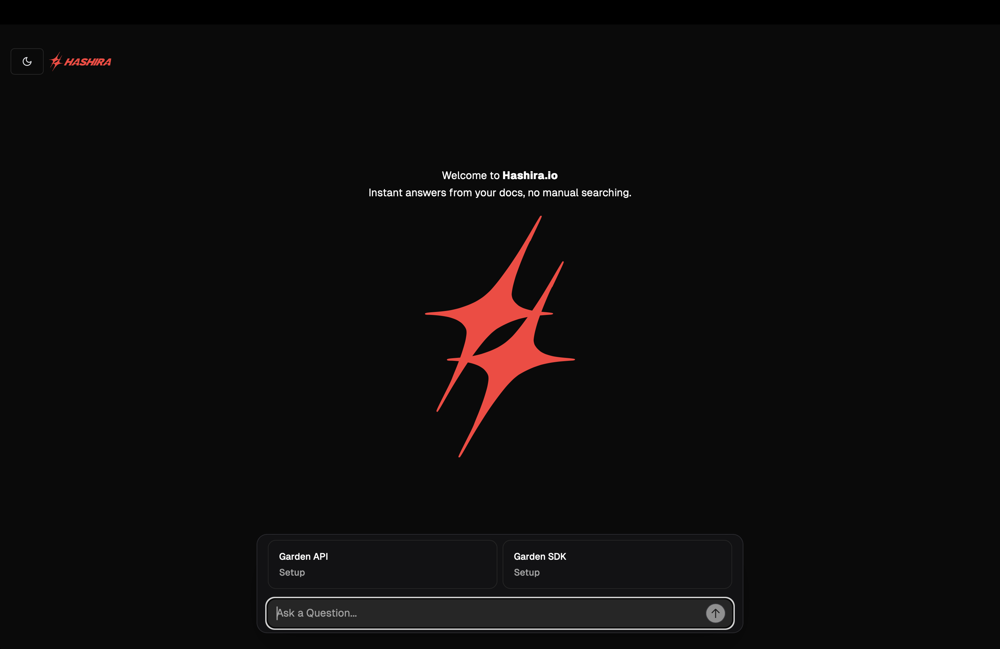
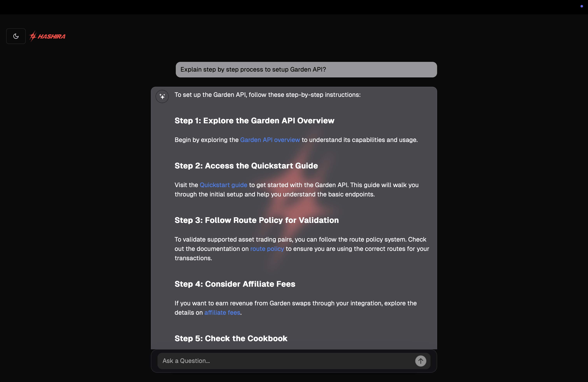
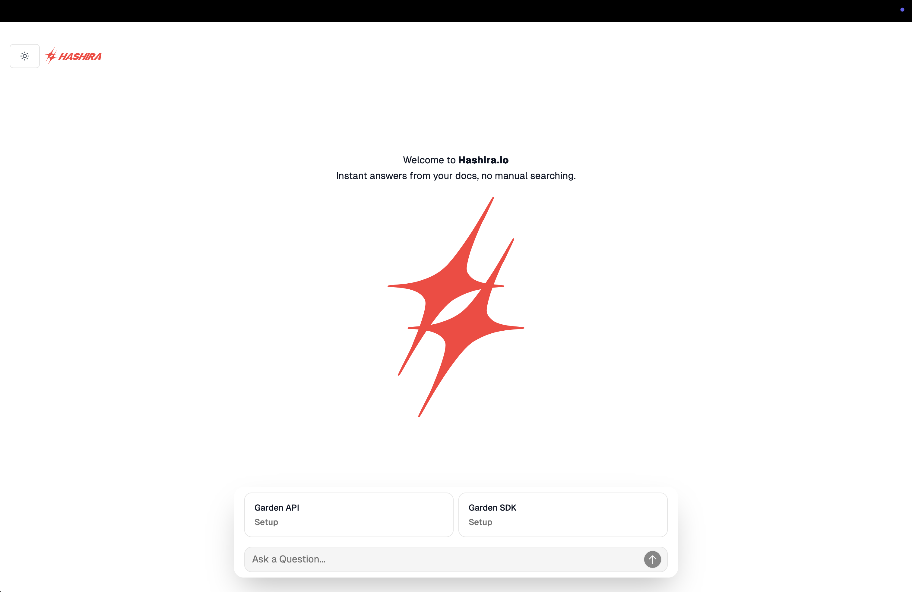
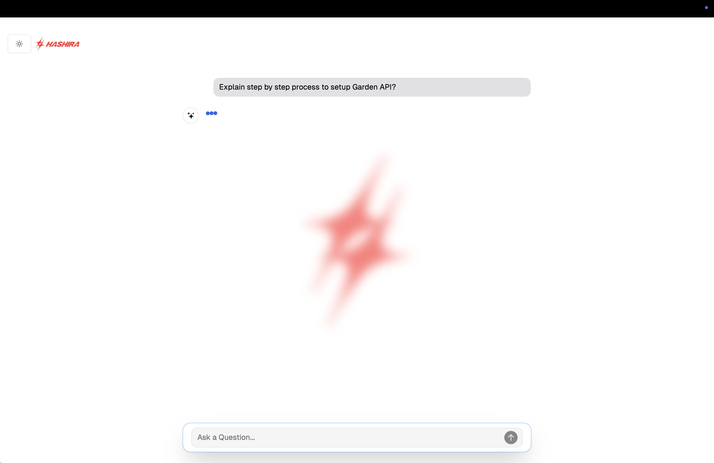
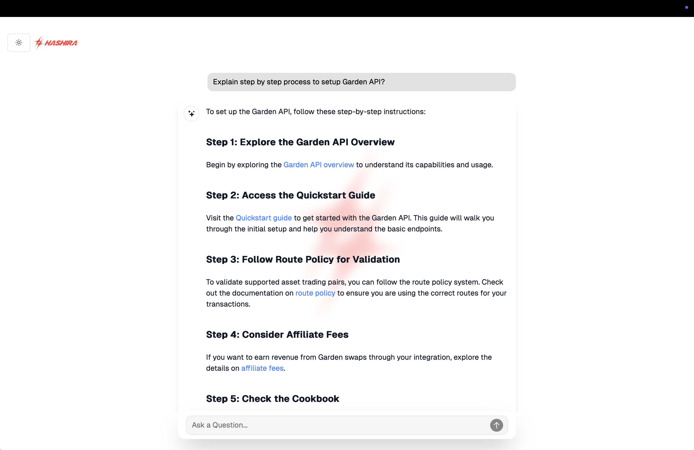

Here’s your updated README.md section, now including instructions for accessing demo photos/GIFs and a demo link for the project:

# HASHIRA-RAG Frontend

## Features

- **Minimalist, elegant chat interface** built with React + TypeScript
- **Markdown rendering**, code blocks, and smart copy
- **Live conversation with your docs**—powered by Qdrant & LLMs
- Supports **backend streaming or non-streaming** responses (API POST/REST)
- **Perfect match for FastAPI RAG backends** with Qdrant/OpenRouter/Groq
- **Glassmorphism UI** & Dark/Light mode

## Demo
- **🎬 Screenshots:**  
  See the [`/Demo`](./Demo) folder for high-res screenshots and demo GIFs of the chat UI in action.

## DarkMode



## LightMode




## Getting Started

**1. Clone the Repo**

```bash
git clone https://github.com/rafathamaan/Hashira-RAG.git
cd Hashira-RAG
```

**2. Install dependencies**

```bash
npm install
```

**3. Configure the backend API endpoint**

- By default, the frontend expects your backend at `http://localhost:8000/ask`.
- If your backend runs elsewhere (e.g., deployed on cloud or LAN),  
  edit the relevant base URL in your API calls (see `/src/components/custom/chat.tsx` or wherever you invoke `fetch`).

**4. Start the app**

```bash
npm run dev
```

_Visit http://localhost:5173 (or as shown in your terminal) in your browser._

## Connecting to Your Backend

This project is pre-configured to send POST requests to your FastAPI backend's `/ask` endpoint:
- **Request Format:**  
  ```json
  { "question": "How do I set up the Garden SDK React Quickstart?" }
  ```
- **Response Format:**  
  ```json
  {
    "answer": "Your natural language answer...",
    "sources": ["Chunk 1 content...", "Chunk 2...", "..."]
  }
  ```

You can adjust the request shape (e.g., to include chat history or advanced metadata) or the endpoint URL as needed.  
_See `/src/components/custom/chat.tsx` for the fetch logic to make edits._

## UI Customization

- **Logo & Branding:**  
  Both header and assistant bubbles can display your `hashira-logomark` SVG (see `/src/components/custom/header.tsx` and `message.tsx`).
- **Theme Toggle:**  
  Switch between dark/light/glassy themes from the header bar.
- **Glassy Bubbles:**  
  Assistant messages appear with background blur for readability atop your logo.

## How to Use

- Type a question about your docs in the chatbox and press enter/send.
- The assistant responds using **retrieved documentation and an LLM** (like GPT-3.5, Llama 3 via OpenRouter/Groq, etc).
- You can view the original doc sources if your backend sends them.

## Project Structure

```
.
├── src/
│   ├── components/
│   │   ├── custom/
│   │   │   ├── chatinput.tsx
│   │   │   ├── chat.tsx
│   │   │   ├── message.tsx
│   │   │   ├── header.tsx
│   │   │   └── ...
│   │   └── ...
│   └── ...
├── Demo/
│  
├── public/
│   └── assets/
│       └── fonts/images/hashira-logomark.svg
├── package.json
└── README.md
```

## Credits

- Inspired by [chatbot-ui](https://github.com/ChristophHandschuh/chatbot-ui) and [Vercel’s AI Chatbot template](https://github.com/vercel/ai-chatbot).

## License

Apache 2.0

## 📣 Need the Backend?

Use with [Hashira RAG Backend](./Backend)  
or any FastAPI/LangChain Qdrant-compatible REST endpoint.

